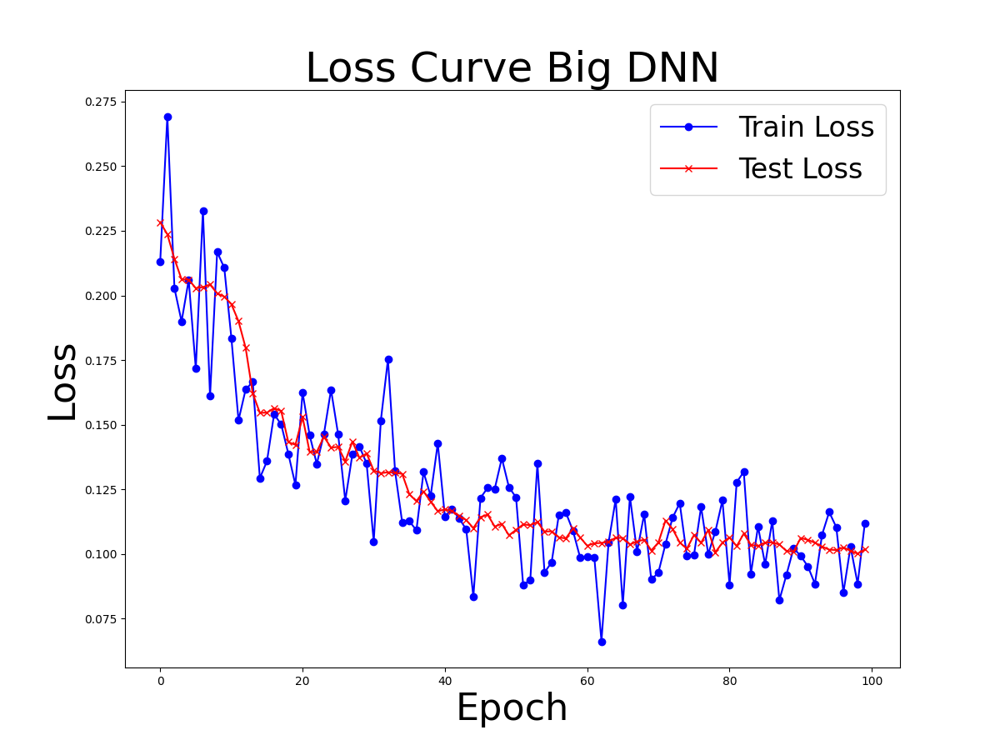
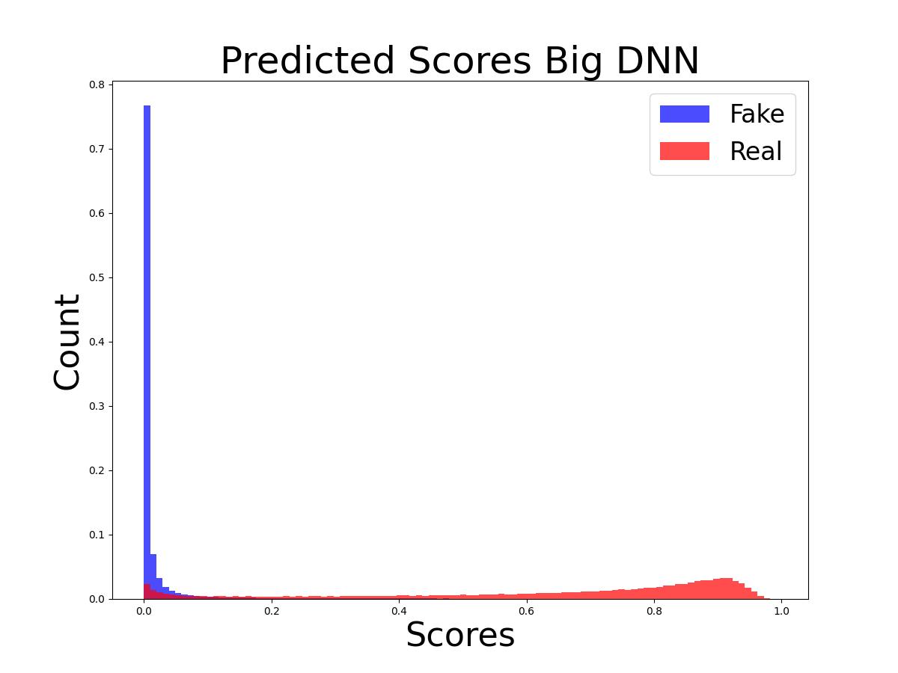
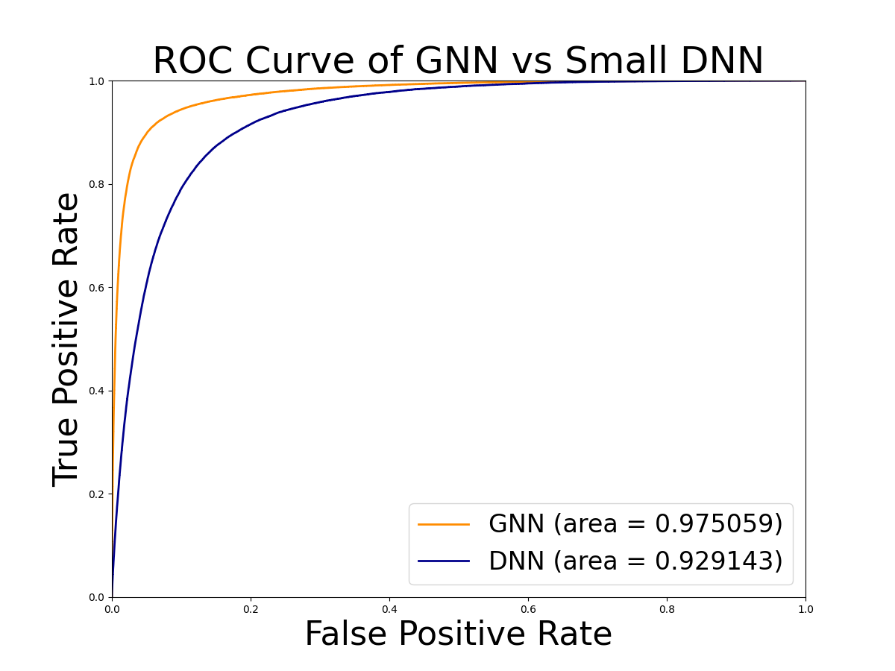
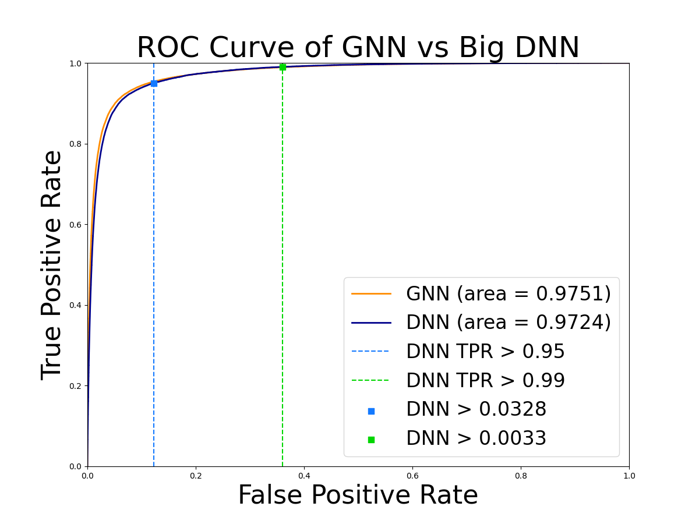

# Using Machine Learning for Particle Tracking at the Large Hadron Collider
Source code of the project titled: _"Using Machine Learning for Particle Tracking at the Large Hadron Collider"_ of the ENLACE 2023 Summer Camp at UCSD.

This project was made for the ENLACE 2023 Research Summer Camp at the UCSD in a timeframe of 7 weeks and its results were to be committed into a
poster (available in the repo) as part of the requirements for the University Students' projects. Most of the code is developed with the PyTorch module.

# Authors

- Alejandro Dennis
- Abraham Jhared Flores Azcona _(NotsoJharedtrollOx17)_  ``abrahamjhared.flores@gmail.com``

# Abstract

lorem ipsum dolor

# Introduction
In the realm of particle physics, the Large Hadron Collider (LHC) stands as a colossal accelerator in Geneva, Switzerland, with its intricate network of superconducting magnets propelling particles to immense energies for experimental collisions. Within the LHC, the Compact Muon Solenoid (CMS) experiment captures the paths of charged particles through a powerful magnetic field, aiming to distinguish accurate tracks amidst the complex particle interactions. Addressing the challenge of efficient track identification, the Line Segment Tracking (LST) algorithm emerges as a solution, reconstructing particle trajectories piece-by-piece, forming linear segments. Notably, LST's modular approach allows for parallelizability, a crucial attribute in tackling the intricate scenarios posed by the forthcoming High-Luminosity LHC (HL-LHC). While LST thrives in parallel processing, it faces limitations in handling increasingly complex scenarios sequentially, thereby highlighting the imperative of harnessing the power of Machine Learning (ML) techniques. This pivotal role of ML is exemplified in our architecture, which leverages Deep Neural Networks (DNNs) with varying hidden layer sizes to process Linear Segments (LS), culminating in an output neuron discerning the authenticity of the track. As a result, we trained two neural networks: (i) Big DNN, and (ii) Small DNN. We compare both model proposals with the lab's main contender, a Graph Neural Network (GNN) model utilizing the same LS while considering their edges and nodes due to the Graph nature of the architechture. We postuladed _a-priori_ that the GNN will be more accurate than our proposed DNNs for the classification task of the LS analyzed.

# Methods

We subdivide this section further into the following subsections: (1) Compared Models, and (2) Code Pipeline. In (1) we describe the hyperparameters of the GNN, the Small DNN, and the Big DNN. In (2) we briefly describe the code snippets of the `./code/` directory and their purpose for extracting results of our model comparison.

All of our Machine Learning experiments were executed inside one remote session of a Linux enviroment provided by the UCSD Supercomputing Cluster. All relevant plots were stored inside `./results/plots/` and they are displayed in the following **Results** section.

## Compared Models

We compared the lab's GNN prediction accuracy with our proposed models, the _Small DNN_ and the _Big DNN_. Hyperparameter data for the models can be appreciated in **Table 1**  The main difference between the _Small DNN_ and the _Big DNN_ is the number of neurons per layer, while the rest of hyperparameters stays the same.

The comparisons made are in the following arrangement: (i) GNN vs. _Small DNN_, and (ii) GNN vs. _Big DNN_. We believed that the GNN model will remain the solid contender for the LS classification task, so it was deemed neccesary to compare the GNN against (i) a DNN with less neurons per layer, and (ii) one with more neurons per layer. This comparison allows the recollection of accuracy metrics to determine the best contender overall.

| Hyperparameters / Model | **GNN*** | **_Small DNN_** | **_Big DNN_** |
|---------------------|---------------|---------------|----------|
| _Input Features_    | 7 node feat. & 3 edge feat. | 14        | 14   |
| _# Hidden Layers_   | 1                           | 2         | 2    |
| _Neurons per Layer_ | 200                         | 32        | 100    |
| _Learning Rate_     | 0.005**                     | 0.002     | 57704    |
| _Epochs_            | 50                          | 50        | 57704    |

**Table 1.** Hyperparemeter Values for Compared Models. _Note_: * the GNN model was trained by Phillip Chang. ** This value steadily decreased by a factor 0.7, every 5 epochs.

## Code Pipeline

In summary, our pipeline consists of helper files, main collation files, training and testing files, and analysis files as well. In particular, for (v) we utilize an Adam optimized per the suggestion of ChatGPT. Furthermore, our mentor considered relevant to utilize the ROC Curve inside (viii) to visualize how well, or how poorly, our trained models were performing _in constrast with_ the lab's GNN.

Adding further, the ROC Curve tells us how accurate and reliable are its predictions of a given binary classification model. We then plot both the GNN and Small DNN curves, and the GNN and Big DNN curves as well, to visually check _how juxtaposed_ are they. If the DNN curve is visually distinct from the GNN curve, we can ascertain that the GNN is doing better for this classification task. If they appear stacked on top of each other, with little to no gaps, the models are performing similar to each other. For an additional empirical check, we also calculate the ROC Curve Area of each model to numerically confirm the performance difference.

| Pipeline Order | Filename | Description |
|---------------------|---------------|---------------|
| i    | `utils.py`                   | _Helper file for a simple progress bar display in the console during the training phase._        |
| ii   | `DeepNeuralNetwork_class.py` | _Helper file with the class defining the size and other features of the DNN models._ |
| iii  | `datasets.py`                | _Helper file with useful LS dataset classes to parse datapoints easily._       |
| iv   | `ingress.py`                 | _Preprocessing pipeline for the LS data. It stabilizes the numerical ranges of the data with log scaling for easier analysis._     |
| v    | `train.py`                   | _Trains the desired model and saves a brief training summary into a JSON file._        |
| vi   | `inference.py`              | _Tests the models and exports its inferences into a CSV file for further processing_     |
| vii  | `exploration.py`             | _Exploratory dataset analysis to calculate the best matches of True Positive Rate ratios on the trained models._     |
| viii | `plots.py`                   | _Console menu to plot the features of the LS dataset as histograms, the loss curve of the trained model, its predicted scores, and the ROC curve comparison between the models._     |

**Table 2.** Description of Python Pipeline Files. _Note_: all files can be found inside the `./code/` directory of this repository.

# Results

The section focuses on the results obtained with the aforementioned _Big DNN_ . The loss curve plot of both the training and testing datasets **[Figure 1]** indicates that the model is indeed learning patters in the training dataset which _are generalizable_ to values in the testing dataset. A curious pattern arose during the training phase, which is this sudden spiky movement similar to the peaks and bottoms of a rollercoaster track.

The prediction scores histogram **[Figure 2]** indicates that the vast majority of data entries of our testing dataset labeled as _Fake_ are indeed classified as _Fake_ by the model. This can be appreciated with the blue distribution of _Fake_ LS near the origin. On a similar fashion, the rest of the LS labeled as _Real_ are distributed to the far right, indicating that the model is classifying them as _Real_. Nevertheless, we can appreciate a little overlap of _Real_ LS on top of the _Fake_ LS of the far left of the plot, which means that the model _did not predicted_ certain LS labeled as _Real_, and classified them as _Fake_; this a given with models related to Binary Classification. On retrospect, the y-axis magnitude was scaled by our mistake into a continuous range of [0, 1]. Most _Fake_ LS which are indeed _Fake_ account for over 70% of the dataset. This is relevant to understand the plot.

Regarding the prediction behaviour, a better way to understand the rate at which we expect mispredictions of the model is with the help of a ROC Curve. It can help by telling us if the model is performing accurate estimations of the _Real_ LS labeled as such (TPR) in contrast to those _Fake_ LS labeled as such being misclassified as _Real_ (FPR). For the comparison of the _GNN_ vs the _Big DNN_, the curve tell us how similar their classifications are to one another. On the first ROC Curve **[Figure 3]**, we can observe that the classification performance of the _Small DNN_ is worse in comparison to the GNN. In contrast with the case of the _Big DNN_ versus the _GNN_, we observe that our DNN is performing as well as the _GNN_ **[Figure 4]**.

Utilizing the same ROC Curve, we plotted two square dots on top of the curve to further reference the estimated coordinates of threshold values which allow a TPR > 0.95, and a TPR > 0.99 respectively. Both of these value thresholds are used to measure the classification accuracy of the models with strict TPR criteria. To appreciate the effect of these ranges on the classification task, the following tables contain the distilled numbers of the total LS considered as a _True Positive_ after surpassing the aforementioned thresholds.

On both **Table 3** and **Table 4** we observe that we get a similar distribution of LS predicted as _Real_ and _Fake_ (like the plot of **Figure 2**). The interesting detail is that, by using the same testing dataset for both the DNN and the GNN, the models are selecting a _substantial amount of the same LS for their respective predictions._

|             | **DNN > _X_** | **GNN > _Y_** | **Both Models** |
|-------------|---------------|---------------|----------|
| Real & Fake | 134876        | 128475        | 106670   |
| Real        | 49628         | 49628         | 48966    |
| Fake        | 85248         | 78847         | 57704    |

**Table 3.** Table of LS selected for a TPR > 0.95. _Note_:
**X** = 0.0328, **Y** = 0.0385. **DNN**: _Big DNN_.

|             | **DNN > _X_** | **GNN > _Y_** | **Both Models** |
|-------------|---------------|---------------|----------|
| Real & Fake | 302497        | 313556        | 245207   |
| Real        | 51716         | 51717         | 51446    |
| Fake        | 250781        | 261839        | 193761   |

**Table 4.** Table of LS selected for a TPR > 0.99. _Note_:
**X** = 0.0032, **Y** = 0.0044. **DNN**: _Big DNN_.



**Figure 1.** Loss Curve of Big DNN.



**Figure 2.** Histogram of Predicted Scores During Testing for Big DNN.



**Figure 3.** ROC Curve of Lab's GNN versus our Small DNN.



**Figure 4.** ROC Curve of Lab's GNN versus our Big DNN.

# Discussion

The development of the data pipeline in Python was the greatest challenge we had. Because the internship were to last a month a half, our fast-learning abilities were to be harvested. With the advent of LLM tools like Chat GPT, we were able to close the knowledge gaps required to develop such findings. Furthermore, utilizing the guidance of our mentor Jonathan Guiang, our research goals were reachable for the scope of this experience, which includes our model proposals for the Line Segment Classification Task.

It is particularly relevant to highlight that with little to no knowledge of the common Data Science workflow, we achieved results that broke our expectations. The proposals of the _Big DNN_ and the _Small DNN_ with their respective hyperparameters came to be with no formal procedure. They were proposed by the authors as a _guestimation_ to start our investigation, where we did not have any expectations of a remarkable result. On that point, the results obtained from the _Small DNN_ were the actual expectation of our job, while the results coming from the _Big DNN_ were the surprise that challenged our initial performance hypothesis, and ourselves.

We must remind the reader that our Research & Development workflow was positively augmented with Chat GPT, which launched into stardom due to its vast amount of uses, where one of them is code development. We believe that any knowledge gaps regarding our Machine Learning knowledge, which were slim to none at the start of the internship, were mitigated by the constant Socratic interaction with the system. As a result, this project also accounts as solid evidence suggesting the strong use case of LLM-based tools for academic research, and knowledge acquisition under tight deadlines.

# Conclusion

The collected evidence strongly suggests that our proposed _Big DNN_ model is a viable alternative to the lab's own _GNN_ for the Line Segment classification task. Furthermore, we believe that a simpler model architecture can lead to savings in processing power cost, and a model development process with less technical debt. The binary classification task of the Line Segments does no benefit further from accounting nodes and edges, but from a model that has a large number of activations per layer. Further research is needed to validate the claims presented on this report.

# Credits

- Jonathan Guiang (mentor)
- Frank Wuerthwein (PI)

# License

MIT License

# Acknowledgement of AI Usage

We hereby state that ChatGPT<sup>1</sup> was utilized for the analysis, interpretation, and code development of the data pipeline that generated the provided plots in the report.

> <sup>1</sup> Full conversation available at [`./ai-conversation/ENLACE-2023-project.md`](./ai-conversation/ENLACE-2023-project.md). The beginning of the backup indicates that it was extracted from Gemini because the original conversation was exported into Gemini.

# Citation

```
@misc{
    dennisflores2023enlaceucsdproject,
    title = {Using Machine Learning for Particle Tracking at the Large Hadron Collider},
    author = {Flores-Azcona, Abraham Jhared and Dennis, Alejandro},
    year = {2023},
    month = {August},
    url = {https://github.com/NotsoJharedtrollOx17/Using_ML_for_Particle_Tracking_at_LHC}
}
```